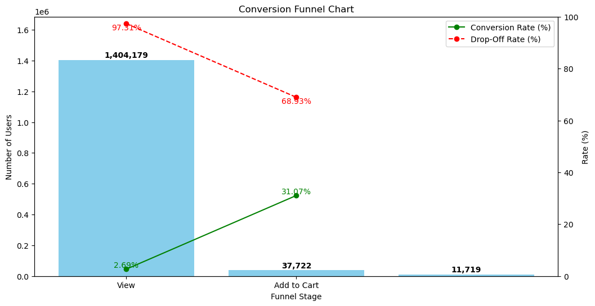
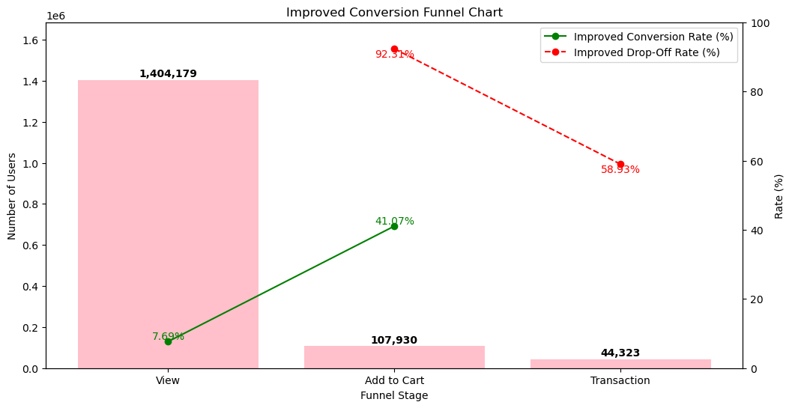

## Retailrocket Funnel Optimization 

This project demonstrates funnel optimization using the Retail Rocket recommendation dataset. The analysis includes identifying key drop-off points in the funnel, proposing hypothetical improvements, and visualizing the potential impact of these improvements.


### Overview
Funnel optimization involves analyzing user behavior through different stages of the funnel, identifying where users drop off, and implementing strategies to reduce these drop-offs and improve conversion rates. This project uses the publicly accessible Retail Rocket recommendation dataset to perform funnel analysis and simulate potential improvements.

### How to Run
1. Clone the repository:
    ```bash
    git clone https://github.com/yourusername/funnel-optimization.git
    cd funnel-optimization
    ```
2. Install the required dependencies:
    ```bash
    pip install -r requirements.txt
    ```
3. Run the analysis script:
    ```bash
    python funnel_optimization.py
    ```

4. Review the generated visualizations and analysis results.

### Requirements
- Python 3.x
- pandas
- matplotlib

### Dataset
The dataset includes user events such as page views, adding items to the cart, and transactions. Key columns include:
- `timestamp`: When the event occurred
- `visitorid`: Unique identifier for the visitor
- `event`: Type of event (e.g., view, addtocart, transaction)
- `itemid`: Identifier for the item
- `transactionid`: Identifier for the transaction (if applicable)

### Analysis Steps
1. **Data Preparation**: Load and clean the dataset, convert timestamps to datetime format, and handle missing values.
2. **Current Funnel Analysis**: Calculate the number of unique users at each stage, conversion rates, and drop-off rates. Visualize the current funnel.
3. **Identify Key Areas for Improvement**: Highlight stages with the highest drop-off rates and suggest potential improvements.
4. **Hypothetical Improvements**: Simulate the impact of hypothetical improvements in conversion rates.
5. **Improved Funnel Visualization**: Compare the current funnel with the improved funnel to show the potential impact of the proposed changes.

### Visualizations
- **Current Conversion Funnel Chart**: Shows the number of users at each stage, conversion rates, and drop-off rates.


- **Improved Conversion Funnel Chart**: Shows the potential impact of hypothetical improvements on the funnel.


### Hypothetical Improvements
The following hypothetical improvements were simulated:
- Increase the conversion rate from View to Add to Cart by 5%.
- Increase the conversion rate from Add to Cart to Transaction by 10%.

### Conclusion
The analysis highlights the key drop-off points in the funnel and demonstrates how targeted improvements can significantly enhance user progression through the funnel. By implementing strategies to increase conversion rates at critical stages, the overall conversion rate can be improved, leading to better user retention and increased transactions.
